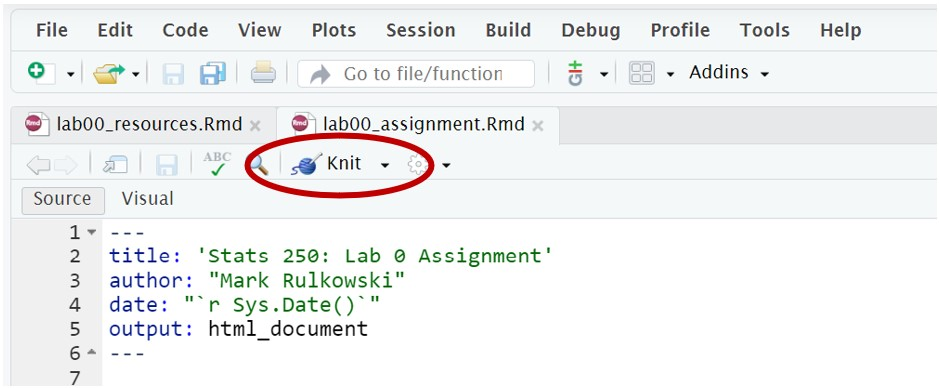
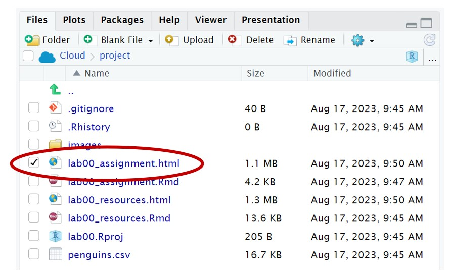
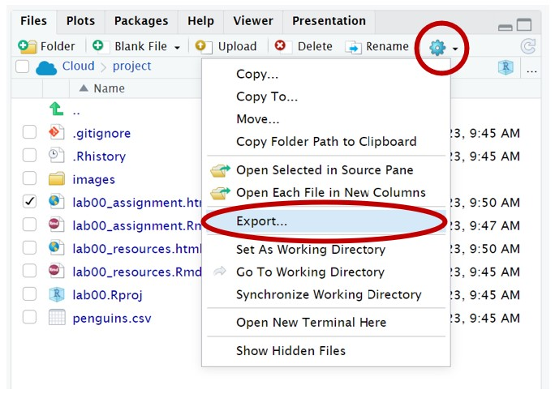
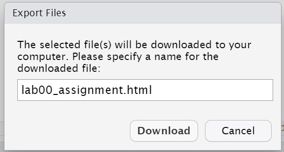

```{r setup, include=FALSE}
knitr::opts_chunk$set(echo = TRUE)
```


### Instructions

Complete the Lab Exercises and Dive Deeper questions below. Typically, there will be seven Lab Exercises (graded out of 2 points each) and two Dive Deeper questions (graded out of 3 points each) - all of them graded for *correctness*. For this first assignment, there are only five Lab Exercises and all questions will be graded for completeness. Upon completion, follow the submission instructions at the bottom of this document. 

***

### Background

For this lab, we will continue working with the `penguins` data set. As a reminder, the `penguins` data set contains information on 333 penguins collected from three islands in the Palmer Archipelago in Antarctica. See the References section at the bottom of the lab resources document for more information.

{width=500px}

Use the following code chunk to read in the data set. 

```{r readpenguins}
penguins <- read.csv("penguins.csv")
```

***

### Lab Exercises

This section of the lab assignment will test your knowledge of the functions learned throughout the lab resources document. This section will involve seven questions that are graded for correctness (2 points each). The questions may require an answer in the form of code, text, or both! For Lab 0, there are only five questions and they will be graded for completeness. 

> **1.** In the code chunk below, multiply 250 by your lab's section number. 

```{r exercise1}
# Replace this text with your code!

```


> **2.** Which of the variables in `penguins` are *quantitative*? List the names of the quantitative variables below. 

*Answer:* Replace this text with your answer.


> **3.** What is the longest bill length found in the data set? In other words, what is the maximum value for the variable `bill_length_mm`? 

```{r exercise3}
# Replace this text with your code!

```


> **4.** How many of the penguins live on Dream island? Create a table for this variable and report the number of penguins below. 

```{r exercise4}
# Replace this text with your code!

```

*Answer:* Replace this text with your answer.


> **5.** One of the most common errors is copying and pasting extra backticks before or after a code chunk. What is the other common error that was discussed in the lab resources document? 

*Answer:* Replace this text with your answer.


***


## Dive Deeper

This section of the lab assignment will have you "dive deeper" into the analysis completed above. This section will involve two questions that are also graded for correctness (3 points each). For Lab 0, these questions will be graded for completeness.  

> **1.** After Lab 0, how do you feel about using R? Do you have any major concerns moving forward with Stats 250?

*Answer:* Replace this text with your answer (1-2 sentences).


> **2.** How do you think statistics will help you in your major or future career?

*Answer:* Replace this text with your answer (1-2 sentences).


***


## Submission Instructions

Carefully follow the instructions below to properly submit your completed work.

1. At the top of the document, change the `author` field to your name (in quotes!). **Do not change any of the other fields (title, date, output) at the top of the document.**

2. When you have finished the lab, click the **Knit** button one last time.

{width=450px}

3. Check the box next to the `lab00_assignment.html` file in the Files window (the bottom right window): 

{width=350px} 

4. Click More > Export. Note: instead of "More", you may see a gear icon instead. You can also resize the Files window to find the "More" button.

{width=300px} 

5. **Do not change the file name (lab00_assignment.html)** Click Download and save the file to your computer.

{width=300px}

6. On the Stats 250 Canvas site, click "Assignments" on the left side of the page. Scroll to find Lab 0 and open the assignment. Click "Submit Assignment".

7. At the bottom of the page, upload your saved `lab00_assignment.html` file. Note: you will only be able to upload a .html file

8. Click "Submit Assignment". You completed Lab 0 - give yourself a high five!
